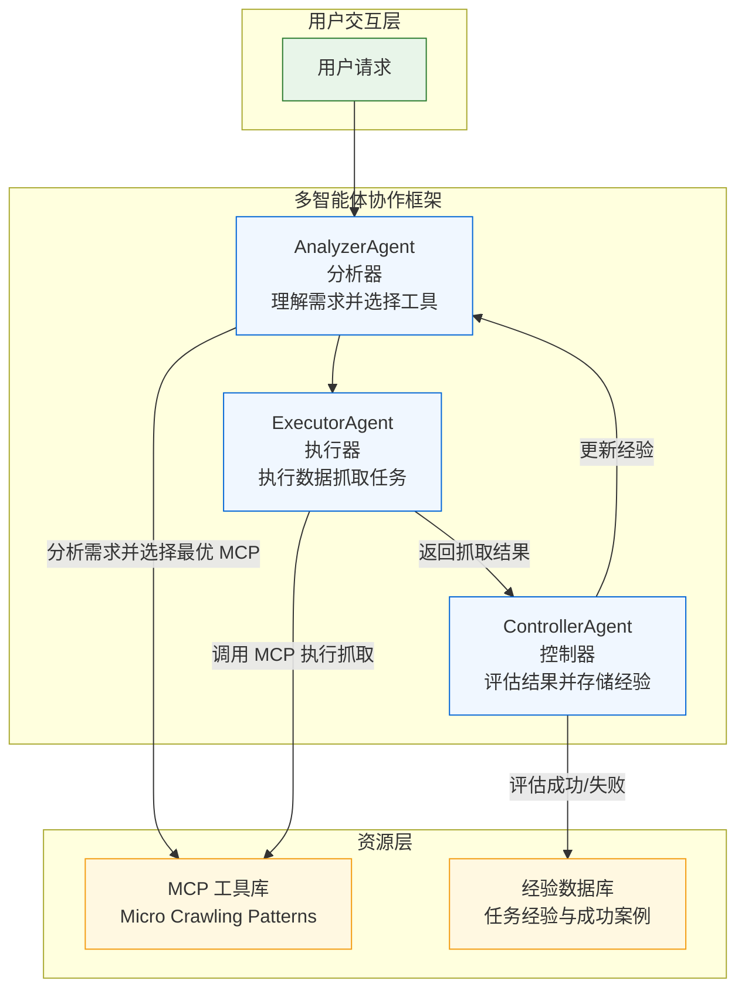

# spiderme - 多智能体Web数据抓取框架
核心思想： 就是根据问题动态使用不同的工具，如果失败，尝试不同工具，然后记录下成功经验，供下一次解决相似问题使用。

`spiderme` 是一个基于多 Agent 协作的智能化Web数据抓取框架。它利用大型语言模型（LLM）的能力，模拟分析、执行、反思和发现的工作流，以自动化和动态的方式解决复杂的数据提取任务。

## 核心架构

项目的核心是四个协同工作的 Agent：

-   **`AnalyzerAgent` (分析器)**: 负责理解用户需求。它通过规则匹配、向量搜索和 LLM 推理相结合的方式，从可用的工具库（MCPs）中选择最合适的解决方案。

-   **`ExecutorAgent` (执行器)**: 动态调用 `AnalyzerAgent` 选定的工具（MCP）来执行实际的数据抓取任务。

-   **`ControllerAgent` (控制器)**: 评估抓取任务是否成功。如果成功，它会将本次任务所使用的方法和工具记录下来，形成经验。当未来遇到相似请求时，`AnalyzerAgent` 可以直接利用这些成功经验，提高效率和准确性。

-   **`DiscoveryAgent` (探索者 - Todo)**: 这是项目的未来计划。该 Agent 能够根据用户问题和现有代码模板，自动探索、生成并验证新的抓取方案。新方案将被保存为一个可复用的 MCP 工具，并纳入到框架的经验库中。

## 主要特色

-   **多智能体协作**: 模拟人类专家团队解决问题的流程，分工明确，逻辑清晰。
-   **动态工具选择**: 能根据任务动态选择最合适的执行方案，而非依赖固定的爬虫脚本。
-   **经验驱动学习**: 具备学习能力，能够从成功的任务中总结经验，持续提升自动化效率。
-   **API 驱动**: 通过 `FastAPI/Starlette` 提供服务，易于集成和二次开发。
-   **可扩展性**: 可以通过添加新的 MCP（Micro-Crawling Pattern）工具或实现 `DiscoveryAgent` 来不断扩展其能力。

## 原理图


## 安装指南

1.  **克隆项目**
    ```bash
    git clone xxx
    cd spiderme
    ```

2.  **安装依赖**
    项目根目录和 `main_datafetcher` 目录下均有依赖文件。请确保两者的依赖都已安装。
    ```bash
    # 安装主依赖
    pip install -r requirements.txt
    # 安装爬虫模块的依赖的浏览器组件等
    crawl4ai-setup
    #验证
    crawl4ai-doctor
    # 安装Agent的依赖
    pip install -r main_datafetcher/requirements.txt
    ```
    *注意：建议使用虚拟环境（如 venv 或 conda）来管理项目依赖。*

3.  **配置环境变量**
    项目中可能包含需要配置 API 密钥或其他敏感信息的部分。请检查 `main_datafetcher/env_template` 文件，并创建相应的 `.env` 文件填入配置。


## 如何使用

1.  **启动 MCP 解决方案服务器**
    根据您的配置，首先启动 `mcp_servers` 目录中定义的微抓取解决方案服务。
    ```bash
    # 示例：启动一个PDF处理服务
    cd mcp_servers
    python mcp_href_pdf.py
    ```

2.  **启动主 Agent 服务**
    `main_datafetcher/main_api.py` 是项目的主入口。运行以下命令启动 Agent API 服务：
    ```bash
    cd main_datafetcher
    python main_api.py
    ```
    -   `--host`: 服务器绑定的主机名，可指定为 `0.0.0.0` 以允许外部访问。
    -   `--port`: 服务器监听的端口号。

3.  **测试服务**
    服务启动后，您可以使用 `example/a2a_client.py` 或其他 HTTP 客户端（如 Postman, curl）来与 Agent API 进行交互，测试其功能是否正常。

## 路线图 (Roadmap)

-   [ ] **实现 `DiscoveryAgent`**: 完成其自动探索和生成新抓取方案的能力，并保存为新的MCP工具。
-   [ ] **完善经验数据库和其它存储数据库**: 优化 `ControllerAgent` 的经验存储和检索逻辑，存储经验结果。
-   [ ] **添加Web UI**: 为框架提供一个用户友好的图形界面，方便监控和管理。
-   [ ] **更多基础的MCP工具**: 现实环境，需要先添加更多的MCP工具。

## 日志
### 客户端的Agent执行日志
```
python /Users/admin/git/spiderme/main_datafetcher/a2a_client.py 
发送message信息: {'message': {'role': 'user', 'parts': [{'type': 'text', 'text': '爬取这个网站中所有pdf文件，保存到华润置地目录下中： https://crland-umb.azurewebsites.net/zh-cn/investors/financial-results-and-presentations/'}], 'messageId': '123456'}, 'metadata': {'download_dir': 'downloaded_pdfs'}}
1760357290.021353
{'id': '123456', 'jsonrpc': '2.0', 'result': {'contextId': '8fd23ce1-f265-4552-ae97-40acb03228af', 'final': False, 'kind': 'status-update', 'status': {'state': 'submitted', 'timestamp': '2025-10-13T12:08:09.694253+00:00'}, 'taskId': '34f1fe4e-d4db-4b6a-98dd-77d0eeeecd2a'}}
{'id': '123456', 'jsonrpc': '2.0', 'result': {'contextId': '8fd23ce1-f265-4552-ae97-40acb03228af', 'final': False, 'kind': 'status-update', 'status': {'state': 'submitted', 'timestamp': '2025-10-13T12:08:09.694253+00:00'}, 'taskId': '34f1fe4e-d4db-4b6a-98dd-77d0eeeecd2a'}}
1760357290.022362
{'id': '123456', 'jsonrpc': '2.0', 'result': {'contextId': '8fd23ce1-f265-4552-ae97-40acb03228af', 'final': False, 'kind': 'status-update', 'status': {'state': 'working', 'timestamp': '2025-10-13T12:08:09.694485+00:00'}, 'taskId': '34f1fe4e-d4db-4b6a-98dd-77d0eeeecd2a'}}
{'id': '123456', 'jsonrpc': '2.0', 'result': {'contextId': '8fd23ce1-f265-4552-ae97-40acb03228af', 'final': False, 'kind': 'status-update', 'status': {'state': 'working', 'timestamp': '2025-10-13T12:08:09.694485+00:00'}, 'taskId': '34f1fe4e-d4db-4b6a-98dd-77d0eeeecd2a'}}
1760357291.9057522
{'id': '123456', 'jsonrpc': '2.0', 'result': {'artifact': {'artifactId': 'a2c17303-7086-4b80-ae68-ed9a2cd21d05', 'metadata': {'author': 'AnalyzerAgent', 'references': []}, 'parts': [{'kind': 'text', 'text': '{"candidates": ["download_pdf_via_href_links", "download_pdf_via_mime_type"]}'}]}, 'contextId': '8fd23ce1-f265-4552-ae97-40acb03228af', 'kind': 'artifact-update', 'taskId': '34f1fe4e-d4db-4b6a-98dd-77d0eeeecd2a'}}
{'id': '123456', 'jsonrpc': '2.0', 'result': {'artifact': {'artifactId': 'a2c17303-7086-4b80-ae68-ed9a2cd21d05', 'metadata': {'author': 'AnalyzerAgent', 'references': []}, 'parts': [{'kind': 'text', 'text': '{"candidates": ["download_pdf_via_href_links", "download_pdf_via_mime_type"]}'}]}, 'contextId': '8fd23ce1-f265-4552-ae97-40acb03228af', 'kind': 'artifact-update', 'taskId': '34f1fe4e-d4db-4b6a-98dd-77d0eeeecd2a'}}
1760357293.767068
{'id': '123456', 'jsonrpc': '2.0', 'result': {'contextId': '8fd23ce1-f265-4552-ae97-40acb03228af', 'final': False, 'kind': 'status-update', 'status': {'message': {'contextId': '8fd23ce1-f265-4552-ae97-40acb03228af', 'kind': 'message', 'messageId': '06201819-9fb7-45a2-99ed-ea6692812c0d', 'metadata': {'author': 'ExecutorAgent', 'show': True, 'references': []}, 'parts': [{'data': {'type': 'function_call', 'id': 'adk-00867290-f1f7-4b54-a1f0-d6818c399e28', 'name': 'download_pdf_via_href_links', 'args': {'url': 'https://crland-umb.azurewebsites.net/zh-cn/investors/financial-results-and-presentations/', 'project_name': '华润置地'}}, 'kind': 'data'}], 'role': 'agent', 'taskId': '34f1fe4e-d4db-4b6a-98dd-77d0eeeecd2a'}, 'state': 'working', 'timestamp': '2025-10-13T12:08:13.737033+00:00'}, 'taskId': '34f1fe4e-d4db-4b6a-98dd-77d0eeeecd2a'}}
{'id': '123456', 'jsonrpc': '2.0', 'result': {'contextId': '8fd23ce1-f265-4552-ae97-40acb03228af', 'final': False, 'kind': 'status-update', 'status': {'message': {'contextId': '8fd23ce1-f265-4552-ae97-40acb03228af', 'kind': 'message', 'messageId': '06201819-9fb7-45a2-99ed-ea6692812c0d', 'metadata': {'author': 'ExecutorAgent', 'show': True, 'references': []}, 'parts': [{'data': {'type': 'function_call', 'id': 'adk-00867290-f1f7-4b54-a1f0-d6818c399e28', 'name': 'download_pdf_via_href_links', 'args': {'url': 'https://crland-umb.azurewebsites.net/zh-cn/investors/financial-results-and-presentations/', 'project_name': '华润置地'}}, 'kind': 'data'}], 'role': 'agent', 'taskId': '34f1fe4e-d4db-4b6a-98dd-77d0eeeecd2a'}, 'state': 'working', 'timestamp': '2025-10-13T12:08:13.737033+00:00'}, 'taskId': '34f1fe4e-d4db-4b6a-98dd-77d0eeeecd2a'}}
1760357396.708362
{'id': '123456', 'jsonrpc': '2.0', 'result': {'contextId': '8fd23ce1-f265-4552-ae97-40acb03228af', 'final': False, 'kind': 'status-update', 'status': {'message': {'contextId': '8fd23ce1-f265-4552-ae97-40acb03228af', 'kind': 'message', 'messageId': '41b2b1e6-7f2c-43c3-bb49-ad983161c2ce', 'metadata': {'author': 'ExecutorAgent', 'show': True, 'references': []}, 'parts': [{'data': {'type': 'function_response', 'id': 'adk-00867290-f1f7-4b54-a1f0-d6818c399e28', 'name': 'download_pdf_via_href_links', 'response': {'result': '{"_meta":null,"content":[{"type":"text","text":"✅ [HREF下载成功]: https://crland-umb.azurewebsites.net/zh-cn/investors/financial-results-and-presentations/","annotations":null,"_meta":null}],"structuredContent":null,"isError":false,"meta":{"server_timestamp":"2025-10-13T12:09:50.344529Z"}}'}}, 'kind': 'data'}], 'role': 'agent', 'taskId': '34f1fe4e-d4db-4b6a-98dd-77d0eeeecd2a'}, 'state': 'working', 'timestamp': '2025-10-13T12:09:56.647239+00:00'}, 'taskId': '34f1fe4e-d4db-4b6a-98dd-77d0eeeecd2a'}}
{'id': '123456', 'jsonrpc': '2.0', 'result': {'contextId': '8fd23ce1-f265-4552-ae97-40acb03228af', 'final': False, 'kind': 'status-update', 'status': {'message': {'contextId': '8fd23ce1-f265-4552-ae97-40acb03228af', 'kind': 'message', 'messageId': '41b2b1e6-7f2c-43c3-bb49-ad983161c2ce', 'metadata': {'author': 'ExecutorAgent', 'show': True, 'references': []}, 'parts': [{'data': {'type': 'function_response', 'id': 'adk-00867290-f1f7-4b54-a1f0-d6818c399e28', 'name': 'download_pdf_via_href_links', 'response': {'result': '{"_meta":null,"content":[{"type":"text","text":"✅ [HREF下载成功]: https://crland-umb.azurewebsites.net/zh-cn/investors/financial-results-and-presentations/","annotations":null,"_meta":null}],"structuredContent":null,"isError":false,"meta":{"server_timestamp":"2025-10-13T12:09:50.344529Z"}}'}}, 'kind': 'data'}], 'role': 'agent', 'taskId': '34f1fe4e-d4db-4b6a-98dd-77d0eeeecd2a'}, 'state': 'working', 'timestamp': '2025-10-13T12:09:56.647239+00:00'}, 'taskId': '34f1fe4e-d4db-4b6a-98dd-77d0eeeecd2a'}}
1760357399.061142
{'id': '123456', 'jsonrpc': '2.0', 'result': {'contextId': '8fd23ce1-f265-4552-ae97-40acb03228af', 'final': False, 'kind': 'status-update', 'status': {'message': {'contextId': '8fd23ce1-f265-4552-ae97-40acb03228af', 'kind': 'message', 'messageId': '66f5d6a4-6760-4359-8054-27233f0e43fc', 'metadata': {'author': 'ExecutorAgent', 'show': True, 'references': []}, 'parts': [{'kind': 'text', 'text': 'SOLVED:true JSON:{"tool":"default_api.download_pdf_via_href_links","answer":"{\\"download_pdf_via_href_links_response\\": {\\"result\\": \\"{\\\\"_meta\\\\":null,\\\\"content\\\\":[{\\\\"type\\\\":\\\\"text\\\\",\\\\"text\\\\":\\\\"✅ [HREF下载成功]: https://crland-umb.azurewebsites.net/zh-cn/investors/financial-results-and-presentations/\\\\",\\\\"annotations\\\\":null,\\\\"_meta\\\\":null}],\\\\"structuredContent\\\\":null,\\\\"isError\\\\":false,\\\\"meta\\\\":{\\\\"server_timestamp\\\\":\\\\"2025-10-13T12:09:50.344529Z\\\\"}}\\"}}"}\n'}], 'role': 'agent', 'taskId': '34f1fe4e-d4db-4b6a-98dd-77d0eeeecd2a'}, 'state': 'working', 'timestamp': '2025-10-13T12:09:59.054788+00:00'}, 'taskId': '34f1fe4e-d4db-4b6a-98dd-77d0eeeecd2a'}}
{'id': '123456', 'jsonrpc': '2.0', 'result': {'contextId': '8fd23ce1-f265-4552-ae97-40acb03228af', 'final': False, 'kind': 'status-update', 'status': {'message': {'contextId': '8fd23ce1-f265-4552-ae97-40acb03228af', 'kind': 'message', 'messageId': '66f5d6a4-6760-4359-8054-27233f0e43fc', 'metadata': {'author': 'ExecutorAgent', 'show': True, 'references': []}, 'parts': [{'kind': 'text', 'text': 'SOLVED:true JSON:{"tool":"default_api.download_pdf_via_href_links","answer":"{\\"download_pdf_via_href_links_response\\": {\\"result\\": \\"{\\\\"_meta\\\\":null,\\\\"content\\\\":[{\\\\"type\\\\":\\\\"text\\\\",\\\\"text\\\\":\\\\"✅ [HREF下载成功]: https://crland-umb.azurewebsites.net/zh-cn/investors/financial-results-and-presentations/\\\\",\\\\"annotations\\\\":null,\\\\"_meta\\\\":null}],\\\\"structuredContent\\\\":null,\\\\"isError\\\\":false,\\\\"meta\\\\":{\\\\"server_timestamp\\\\":\\\\"2025-10-13T12:09:50.344529Z\\\\"}}\\"}}"}\n'}], 'role': 'agent', 'taskId': '34f1fe4e-d4db-4b6a-98dd-77d0eeeecd2a'}, 'state': 'working', 'timestamp': '2025-10-13T12:09:59.054788+00:00'}, 'taskId': '34f1fe4e-d4db-4b6a-98dd-77d0eeeecd2a'}}
1760357399.061632
{'id': '123456', 'jsonrpc': '2.0', 'result': {'artifact': {'artifactId': 'b154c888-db22-4295-bc4b-e793f0ec5a96', 'metadata': {'author': 'ControllerAgent', 'references': []}, 'parts': [{'kind': 'text', 'text': '✅ 已解决：SOLVED:true JSON:{"tool":"default_api.download_pdf_via_href_links","answer":"{\\"download_pdf_via_href_links_response\\": {\\"result\\": \\"{\\\\"_meta\\\\":null,\\\\"content\\\\":[{\\\\"type\\\\":\\\\"text\\\\",\\\\"text\\\\":\\\\"✅ [HREF下载成功]: https://crland-umb.azurewebsites.net/zh-cn/investors/financial-results-and-presentations/\\\\",\\\\"annotations\\\\":null,\\\\"_meta\\\\":null}],\\\\"structuredContent\\\\":null,\\\\"isError\\\\":false,\\\\"meta\\\\":{\\\\"server_timestamp\\\\":\\\\"2025-10-13T12:09:50.344529Z\\\\"}}\\"}}"}\n（工具：none；尝试次数：1）'}]}, 'contextId': '8fd23ce1-f265-4552-ae97-40acb03228af', 'kind': 'artifact-update', 'taskId': '34f1fe4e-d4db-4b6a-98dd-77d0eeeecd2a'}}
{'id': '123456', 'jsonrpc': '2.0', 'result': {'artifact': {'artifactId': 'b154c888-db22-4295-bc4b-e793f0ec5a96', 'metadata': {'author': 'ControllerAgent', 'references': []}, 'parts': [{'kind': 'text', 'text': '✅ 已解决：SOLVED:true JSON:{"tool":"default_api.download_pdf_via_href_links","answer":"{\\"download_pdf_via_href_links_response\\": {\\"result\\": \\"{\\\\"_meta\\\\":null,\\\\"content\\\\":[{\\\\"type\\\\":\\\\"text\\\\",\\\\"text\\\\":\\\\"✅ [HREF下载成功]: https://crland-umb.azurewebsites.net/zh-cn/investors/financial-results-and-presentations/\\\\",\\\\"annotations\\\\":null,\\\\"_meta\\\\":null}],\\\\"structuredContent\\\\":null,\\\\"isError\\\\":false,\\\\"meta\\\\":{\\\\"server_timestamp\\\\":\\\\"2025-10-13T12:09:50.344529Z\\\\"}}\\"}}"}\n（工具：none；尝试次数：1）'}]}, 'contextId': '8fd23ce1-f265-4552-ae97-40acb03228af', 'kind': 'artifact-update', 'taskId': '34f1fe4e-d4db-4b6a-98dd-77d0eeeecd2a'}}
Process finished with exit code 0
```

### 服务端的日志
```import sys; print('Python %s on %s' % (sys.version, sys.platform))
/Users/admin/miniforge3/envs/a2a/bin/python -X pycache_prefix=/Users/admin/Library/Caches/JetBrains/PyCharmCE2025.1/cpython-cache /Applications/PyCharm CE.app/Contents/plugins/python-ce/helpers/pydev/pydevd.py --multiprocess --qt-support=auto --client 127.0.0.1 --port 49966 --file /Users/admin/git/spiderme/main_datafetcher/main_api.py 
Connected to pydev debugger (build 251.26094.141)
2025/10/13 20:07:41 - INFO - google_adk.google.adk.models.registry -  Updating LLM class for gemini-.* from <class 'google.adk.models.google_llm.Gemini'> to <class 'google.adk.models.google_llm.Gemini'>
2025/10/13 20:07:41 - INFO - google_adk.google.adk.models.registry -  Updating LLM class for projects\/.+\/locations\/.+\/endpoints\/.+ from <class 'google.adk.models.google_llm.Gemini'> to <class 'google.adk.models.google_llm.Gemini'>
2025/10/13 20:07:41 - INFO - google_adk.google.adk.models.registry -  Updating LLM class for projects\/.+\/locations\/.+\/publishers\/google\/models\/gemini.+ from <class 'google.adk.models.google_llm.Gemini'> to <class 'google.adk.models.google_llm.Gemini'>
2025/10/13 20:07:41 - INFO - google_adk.google.adk.models.registry -  Updating LLM class for gemini-.* from <class 'google.adk.models.google_llm.Gemini'> to <class 'google.adk.models.google_llm.Gemini'>
2025/10/13 20:07:41 - INFO - google_adk.google.adk.models.registry -  Updating LLM class for projects\/.+\/locations\/.+\/endpoints\/.+ from <class 'google.adk.models.google_llm.Gemini'> to <class 'google.adk.models.google_llm.Gemini'>
2025/10/13 20:07:41 - INFO - google_adk.google.adk.models.registry -  Updating LLM class for projects\/.+\/locations\/.+\/publishers\/google\/models\/gemini.+ from <class 'google.adk.models.google_llm.Gemini'> to <class 'google.adk.models.google_llm.Gemini'>
2025/10/13 20:07:43 - INFO - httpx -  HTTP Request: GET https://raw.githubusercontent.com/BerriAI/litellm/main/model_prices_and_context_window.json "HTTP/1.1 200 OK"
2025/10/13 20:07:44 - INFO - httpx -  HTTP Request: GET http://localhost:8000/sse "HTTP/1.1 307 Temporary Redirect"
2025/10/13 20:07:44 - INFO - httpx -  HTTP Request: GET http://localhost:8000/sse/ "HTTP/1.1 200 OK"
2025/10/13 20:07:44 - INFO - httpx -  HTTP Request: POST http://localhost:8000/messages/?session_id=cabd3d0aa84c495fbb9932b63d59a79b "HTTP/1.1 202 Accepted"
2025/10/13 20:07:44 - INFO - httpx -  HTTP Request: POST http://localhost:8000/messages/?session_id=cabd3d0aa84c495fbb9932b63d59a79b "HTTP/1.1 202 Accepted"
2025/10/13 20:07:44 - INFO - httpx -  HTTP Request: POST http://localhost:8000/messages/?session_id=cabd3d0aa84c495fbb9932b63d59a79b "HTTP/1.1 202 Accepted"
✅ Loaded 3 tools dynamically from http://localhost:8000/sse
2025/10/13 20:07:50 - INFO - __main__ -  使用普通输出模式
2025/10/13 20:07:50 - INFO - __main__ -  服务启动中，监听地址: http://localhost:10086
/Users/admin/miniforge3/envs/a2a/lib/python3.11/site-packages/websockets/legacy/__init__.py:6: DeprecationWarning: websockets.legacy is deprecated; see https://websockets.readthedocs.io/en/stable/howto/upgrade.html for upgrade instructions
  warnings.warn(  # deprecated in 14.0 - 2024-11-09
/Users/admin/miniforge3/envs/a2a/lib/python3.11/site-packages/uvicorn/protocols/websockets/websockets_impl.py:17: DeprecationWarning: websockets.server.WebSocketServerProtocol is deprecated
  from websockets.server import WebSocketServerProtocol
INFO:     Started server process [32318]
INFO:     Waiting for application startup.
INFO:     Application startup complete.
INFO:     Uvicorn running on http://localhost:10086 (Press CTRL+C to quit)
INFO:     ::1:50183 - "GET /.well-known/agent.json HTTP/1.1" 200 OK
INFO:     ::1:50183 - "POST / HTTP/1.1" 200 OK
2025/10/13 20:08:09 - DEBUG - adk_agent_executor -  收到请求信息: parts=[Part(
  text='爬取这个网站中所有pdf文件，保存到华润置地目录下中： https://crland-umb.azurewebsites.net/zh-cn/investors/financial-results-and-presentations/'
)] role='user'
2025/10/13 20:08:09 - INFO - adk_agent_executor -  收到请求信息: parts=[Part(
  text='爬取这个网站中所有pdf文件，保存到华润置地目录下中： https://crland-umb.azurewebsites.net/zh-cn/investors/financial-results-and-presentations/'
)] role='user'
2025/10/13 20:08:09 - INFO - slide_agent.sub_agents.innovation_agents.agent -  [AnalyzerAgent] start. question=爬取这个网站中所有pdf文件，保存到华润置地目录下中： https://crland-umb.azurewebsites.net/zh-cn/investors/financial-results-and-presentations/
20:08:09 - LiteLLM:DEBUG: utils.py:340 - 
event.content没有结果，跳过, Agent是: ProblemSolverSystemAgent, event是: content=None grounding_metadata=None partial=None turn_complete=None error_code=None error_message=None interrupted=None custom_metadata=None usage_metadata=None invocation_id='e-bc1fd417-ab74-4940-8d7e-dd237eafd0b3' author='ProblemSolverSystemAgent' actions=EventActions(skip_summarization=None, state_delta={'question': '爬取这个网站中所有pdf文件，保存到华润置地目录下中： https://crland-umb.azurewebsites.net/zh-cn/investors/financial-results-and-presentations/', 'attempts': 0, 'max_attempts': 6, 'tried_tools': [], 'failed_attempts': [], 'tool_candidates': [], 'solved': False, 'final_answer': None, 'used_tool': None, 'try_tool_number': 2, 'cached_tool': None}, artifact_delta={}, transfer_to_agent=None, escalate=None, requested_auth_configs={}) long_running_tool_ids=None branch=None id='nZ4moNlM' timestamp=1760357289.702972
event.content没有结果，跳过, Agent是: ProblemSolverLoopAgent, event是: content=None grounding_metadata=None partial=None turn_complete=None error_code=None error_message=None interrupted=None custom_metadata=None usage_metadata=None invocation_id='e-bc1fd417-ab74-4940-8d7e-dd237eafd0b3' author='ProblemSolverLoopAgent' actions=EventActions(skip_summarization=None, state_delta={'tool_candidates': [], 'attempts': 0, 'max_attempts': 6, 'tried_tools': [], 'failed_attempts': []}, artifact_delta={}, transfer_to_agent=None, escalate=None, requested_auth_configs={}) long_running_tool_ids=None branch=None id='ScLdf1Su' timestamp=1760357289.703363
2025/10/13 20:08:09 - DEBUG - LiteLLM -  
20:08:09 - LiteLLM:DEBUG: utils.py:340 - Request to litellm:
2025/10/13 20:08:09 - DEBUG - LiteLLM -  Request to litellm:
20:08:09 - LiteLLM:DEBUG: utils.py:340 - litellm.acompletion(model='openai/gpt-4.1', messages=[{'role': 'developer', 'content': '你是工具调度分析器。请阅读用户问题与已失败的工具，\n从下面的工具中选择**最有可能解决问题**的至多 2 个工具名，按优先级从高到低返回。\n工具清单：\ndownload_pdf_via_href_links: 从网页中提取所有直接以 `.pdf` 结尾的超链接 (href)，并通过浏览器自动触发下载。\n默认使用这个即可下做所有pdf文件了，优先使用。\n📘 特点:\n- 使用 crawl4ai 的异步浏览器；\n- 扫描页面中 `a[href$=\'.pdf\']` 等链接；\n- 适用于直接可访问的 PDF 文件链接；\n- 不解析 <a type="application/pdf"> 类型。\n\n:param url: 目标网页 URL\n:param project_name: 下载项目名称 (用于保存目录)\n:return: 下载结果\ndownload_pdf_via_mime_type: 通过识别页面中声明 MIME 类型为 `application/pdf` 的链接下载 PDF。\n\n📘 特点:\n- 同样基于 crawl4ai；\n- 匹配 <a type="application/pdf"> 标签；\n- 适用于网站使用 MIME 类型而非后缀标识 PDF 的情况；\n- 兼容 href 含 .pdf 的常规链接。\n\n:param url: 目标网页 URL\n:param project_name: 下载项目名称\n:return: 下载结果\ndownload_pdf_via_html_parse: 直接抓取网页 HTML 内容，通过正则表达式提取所有 PDF 链接并下载。\n\n📘 特点:\n- 不依赖 JS 执行；\n- 使用 aiohttp 逐个请求 PDF；\n- 适合静态页面；\n- 无法处理异步加载的 PDF 链接。\n\n:param url: 目标网页 URL\n:param project_name: 下载项目名称\n:return: 下载结果\n\n\n用户问题：爬取这个网站中所有pdf文件，保存到华润置地目录下中： https://crland-umb.azurewebsites.net/zh-cn/investors/financial-results-and-presentations/\n已失败的工具：无\n\n请仅输出 JSON（不要输出其它内容）：\n{"candidates": ["<tool_name_1>", "<tool_name_2>"]}\n\n\nYou are an agent. Your internal name is "AnalyzerAgent".\n\n The description about you is "分析问题并给出下一轮要尝试的候选工具"'}, {'role': 'user', 'content': '爬取这个网站中所有pdf文件，保存到华润置地目录下中： https://crland-umb.azurewebsites.net/zh-cn/investors/financial-results-and-presentations/'}], tools=None, response_format=None, api_key='xxx', api_base='https://api.openai.com/v1')
2025/10/13 20:08:09 - DEBUG - LiteLLM -  litellm.acompletion(model='openai/gpt-4.1', messages=[{'role': 'developer', 'content': '你是工具调度分析器。请阅读用户问题与已失败的工具，\n从下面的工具中选择**最有可能解决问题**的至多 2 个工具名，按优先级从高到低返回。\n工具清单：\ndownload_pdf_via_href_links: 从网页中提取所有直接以 `.pdf` 结尾的超链接 (href)，并通过浏览器自动触发下载。\n默认使用这个即可下做所有pdf文件了，优先使用。\n📘 特点:\n- 使用 crawl4ai 的异步浏览器；\n- 扫描页面中 `a[href$=\'.pdf\']` 等链接；\n- 适用于直接可访问的 PDF 文件链接；\n- 不解析 <a type="application/pdf"> 类型。\n\n:param url: 目标网页 URL\n:param project_name: 下载项目名称 (用于保存目录)\n:return: 下载结果\ndownload_pdf_via_mime_type: 通过识别页面中声明 MIME 类型为 `application/pdf` 的链接下载 PDF。\n\n📘 特点:\n- 同样基于 crawl4ai；\n- 匹配 <a type="application/pdf"> 标签；\n- 适用于网站使用 MIME 类型而非后缀标识 PDF 的情况；\n- 兼容 href 含 .pdf 的常规链接。\n\n:param url: 目标网页 URL\n:param project_name: 下载项目名称\n:return: 下载结果\ndownload_pdf_via_html_parse: 直接抓取网页 HTML 内容，通过正则表达式提取所有 PDF 链接并下载。\n\n📘 特点:\n- 不依赖 JS 执行；\n- 使用 aiohttp 逐个请求 PDF；\n- 适合静态页面；\n- 无法处理异步加载的 PDF 链接。\n\n:param url: 目标网页 URL\n:param project_name: 下载项目名称\n:return: 下载结果\n\n\n用户问题：爬取这个网站中所有pdf文件，保存到华润置地目录下中： https://crland-umb.azurewebsites.net/zh-cn/investors/financial-results-and-presentations/\n已失败的工具：无\n\n请仅输出 JSON（不要输出其它内容）：\n{"candidates": ["<tool_name_1>", "<tool_name_2>"]}\n\n\nYou are an agent. Your internal name is "AnalyzerAgent".\n\n The description about you is "分析问题并给出下一轮要尝试的候选工具"'}, {'role': 'user', 'content': '爬取这个网站中所有pdf文件，保存到华润置地目录下中： https://crland-umb.azurewebsites.net/zh-cn/investors/financial-results-and-presentations/'}], tools=None, response_format=None, api_key='xxx', api_base='https://api.openai.com/v1')
20:08:09 - LiteLLM:DEBUG: utils.py:340 - 
2025/10/13 20:08:09 - DEBUG - LiteLLM -  
20:08:09 - LiteLLM:DEBUG: litellm_logging.py:461 - self.optional_params: {}
2025/10/13 20:08:09 - DEBUG - LiteLLM -  self.optional_params: {}
20:08:09 - LiteLLM:DEBUG: utils.py:340 - ASYNC kwargs[caching]: False; litellm.cache: None; kwargs.get('cache'): None
2025/10/13 20:08:09 - DEBUG - LiteLLM -  ASYNC kwargs[caching]: False; litellm.cache: None; kwargs.get('cache'): None
20:08:09 - LiteLLM:DEBUG: caching_handler.py:211 - CACHE RESULT: None
2025/10/13 20:08:09 - DEBUG - LiteLLM -  CACHE RESULT: None
20:08:09 - LiteLLM:DEBUG: base_utils.py:184 - Translating developer role to system role for non-OpenAI providers.
2025/10/13 20:08:09 - DEBUG - LiteLLM -  Translating developer role to system role for non-OpenAI providers.
20:08:09 - LiteLLM:INFO: utils.py:3064 - 
LiteLLM completion() model= gpt-4.1; provider = openai
2025/10/13 20:08:09 - INFO - LiteLLM -  
LiteLLM completion() model= gpt-4.1; provider = openai
20:08:09 - LiteLLM:DEBUG: utils.py:3067 - 
LiteLLM: Params passed to completion() {'model': 'gpt-4.1', 'functions': None, 'function_call': None, 'temperature': None, 'top_p': None, 'n': None, 'stream': None, 'stream_options': None, 'stop': None, 'max_tokens': None, 'max_completion_tokens': None, 'modalities': None, 'prediction': None, 'audio': None, 'presence_penalty': None, 'frequency_penalty': None, 'logit_bias': None, 'user': None, 'custom_llm_provider': 'openai', 'response_format': None, 'seed': None, 'tools': None, 'tool_choice': None, 'max_retries': None, 'logprobs': None, 'top_logprobs': None, 'extra_headers': None, 'api_version': None, 'parallel_tool_calls': None, 'drop_params': None, 'allowed_openai_params': None, 'reasoning_effort': None, 'additional_drop_params': None, 'messages': [{'role': 'system', 'content': '你是工具调度分析器。请阅读用户问题与已失败的工具，\n从下面的工具中选择**最有可能解决问题**的至多 2 个工具名，按优先级从高到低返回。\n工具清单：\ndownload_pdf_via_href_links: 从网页中提取所有直接以 `.pdf` 结尾的超链接 (href)，并通过浏览器自动触发下载。\n默认使用这个即可下做所有pdf文件了，优先使用。\n📘 特点:\n- 使用 crawl4ai 的异步浏览器；\n- 扫描页面中 `a[href$=\'.pdf\']` 等链接；\n- 适用于直接可访问的 PDF 文件链接；\n- 不解析 <a type="application/pdf"> 类型。\n\n:param url: 目标网页 URL\n:param project_name: 下载项目名称 (用于保存目录)\n:return: 下载结果\ndownload_pdf_via_mime_type: 通过识别页面中声明 MIME 类型为 `application/pdf` 的链接下载 PDF。\n\n📘 特点:\n- 同样基于 crawl4ai；\n- 匹配 <a type="application/pdf"> 标签；\n- 适用于网站使用 MIME 类型而非后缀标识 PDF 的情况；\n- 兼容 href 含 .pdf 的常规链接。\n\n:param url: 目标网页 URL\n:param project_name: 下载项目名称\n:return: 下载结果\ndownload_pdf_via_html_parse: 直接抓取网页 HTML 内容，通过正则表达式提取所有 PDF 链接并下载。\n\n📘 特点:\n- 不依赖 JS 执行；\n- 使用 aiohttp 逐个请求 PDF；\n- 适合静态页面；\n- 无法处理异步加载的 PDF 链接。\n\n:param url: 目标网页 URL\n:param project_name: 下载项目名称\n:return: 下载结果\n\n\n用户问题：爬取这个网站中所有pdf文件，保存到华润置地目录下中： https://crland-umb.azurewebsites.net/zh-cn/investors/financial-results-and-presentations/\n已失败的工具：无\n\n请仅输出 JSON（不要输出其它内容）：\n{"candidates": ["<tool_name_1>", "<tool_name_2>"]}\n\n\nYou are an agent. Your internal name is "AnalyzerAgent".\n\n The description about you is "分析问题并给出下一轮要尝试的候选工具"'}, {'role': 'user', 'content': '爬取这个网站中所有pdf文件，保存到华润置地目录下中： https://crland-umb.azurewebsites.net/zh-cn/investors/financial-results-and-presentations/'}], 'thinking': None, 'web_search_options': None}
2025/10/13 20:08:09 - DEBUG - LiteLLM -  
LiteLLM: Params passed to completion() {'model': 'gpt-4.1', 'functions': None, 'function_call': None, 'temperature': None, 'top_p': None, 'n': None, 'stream': None, 'stream_options': None, 'stop': None, 'max_tokens': None, 'max_completion_tokens': None, 'modalities': None, 'prediction': None, 'audio': None, 'presence_penalty': None, 'frequency_penalty': None, 'logit_bias': None, 'user': None, 'custom_llm_provider': 'openai', 'response_format': None, 'seed': None, 'tools': None, 'tool_choice': None, 'max_retries': None, 'logprobs': None, 'top_logprobs': None, 'extra_headers': None, 'api_version': None, 'parallel_tool_calls': None, 'drop_params': None, 'allowed_openai_params': None, 'reasoning_effort': None, 'additional_drop_params': None, 'messages': [{'role': 'system', 'content': '你是工具调度分析器。请阅读用户问题与已失败的工具，\n从下面的工具中选择**最有可能解决问题**的至多 2 个工具名，按优先级从高到低返回。\n工具清单：\ndownload_pdf_via_href_links: 从网页中提取所有直接以 `.pdf` 结尾的超链接 (href)，并通过浏览器自动触发下载。\n默认使用这个即可下做所有pdf文件了，优先使用。\n📘 特点:\n- 使用 crawl4ai 的异步浏览器；\n- 扫描页面中 `a[href$=\'.pdf\']` 等链接；\n- 适用于直接可访问的 PDF 文件链接；\n- 不解析 <a type="application/pdf"> 类型。\n\n:param url: 目标网页 URL\n:param project_name: 下载项目名称 (用于保存目录)\n:return: 下载结果\ndownload_pdf_via_mime_type: 通过识别页面中声明 MIME 类型为 `application/pdf` 的链接下载 PDF。\n\n📘 特点:\n- 同样基于 crawl4ai；\n- 匹配 <a type="application/pdf"> 标签；\n- 适用于网站使用 MIME 类型而非后缀标识 PDF 的情况；\n- 兼容 href 含 .pdf 的常规链接。\n\n:param url: 目标网页 URL\n:param project_name: 下载项目名称\n:return: 下载结果\ndownload_pdf_via_html_parse: 直接抓取网页 HTML 内容，通过正则表达式提取所有 PDF 链接并下载。\n\n📘 特点:\n- 不依赖 JS 执行；\n- 使用 aiohttp 逐个请求 PDF；\n- 适合静态页面；\n- 无法处理异步加载的 PDF 链接。\n\n:param url: 目标网页 URL\n:param project_name: 下载项目名称\n:return: 下载结果\n\n\n用户问题：爬取这个网站中所有pdf文件，保存到华润置地目录下中： https://crland-umb.azurewebsites.net/zh-cn/investors/financial-results-and-presentations/\n已失败的工具：无\n\n请仅输出 JSON（不要输出其它内容）：\n{"candidates": ["<tool_name_1>", "<tool_name_2>"]}\n\n\nYou are an agent. Your internal name is "AnalyzerAgent".\n\n The description about you is "分析问题并给出下一轮要尝试的候选工具"'}, {'role': 'user', 'content': '爬取这个网站中所有pdf文件，保存到华润置地目录下中： https://crland-umb.azurewebsites.net/zh-cn/investors/financial-results-and-presentations/'}], 'thinking': None, 'web_search_options': None}
20:08:09 - LiteLLM:DEBUG: utils.py:3070 - 
LiteLLM: Non-Default params passed to completion() {}
2025/10/13 20:08:09 - DEBUG - LiteLLM -  
LiteLLM: Non-Default params passed to completion() {}
20:08:09 - LiteLLM:DEBUG: utils.py:340 - Final returned optional params: {'extra_body': {}}
2025/10/13 20:08:09 - DEBUG - LiteLLM -  Final returned optional params: {'extra_body': {}}
20:08:09 - LiteLLM:DEBUG: litellm_logging.py:461 - self.optional_params: {'extra_body': {}}
2025/10/13 20:08:09 - DEBUG - LiteLLM -  self.optional_params: {'extra_body': {}}
2025/10/13 20:08:09 - INFO - a2a.server.tasks.task_manager -  Task not found or task_id not set. Creating new task for event (task_id: 34f1fe4e-d4db-4b6a-98dd-77d0eeeecd2a, context_id: 8fd23ce1-f265-4552-ae97-40acb03228af).
/Users/admin/miniforge3/envs/a2a/lib/python3.11/site-packages/a2a/server/tasks/task_manager.py:146: DeprecationWarning: Setting field 'status' via its camelCase alias is deprecated and will be removed in version 0.3.0 Use the snake_case name 'status' instead.
  task.status = event.status
20:08:09 - LiteLLM:DEBUG: http_handler.py:530 - Using AiohttpTransport...
2025/10/13 20:08:09 - DEBUG - LiteLLM -  Using AiohttpTransport...
20:08:09 - LiteLLM:DEBUG: http_handler.py:554 - Creating AiohttpTransport...
2025/10/13 20:08:09 - DEBUG - LiteLLM -  Creating AiohttpTransport...
20:08:09 - LiteLLM:DEBUG: litellm_logging.py:908 - 
POST Request Sent from LiteLLM:
curl -X POST \
https://api.openai.com/v1/ \
-H 'Authorization: Be****cA' \
-d '{'model': 'gpt-4.1', 'messages': [{'role': 'system', 'content': '你是工具调度分析器。请阅读用户问题与已失败的工具，\n从下面的工具中选择**最有可能解决问题**的至多 2 个工具名，按优先级从高到低返回。\n工具清单：\ndownload_pdf_via_href_links: 从网页中提取所有直接以 `.pdf` 结尾的超链接 (href)，并通过浏览器自动触发下载。\n默认使用这个即可下做所有pdf文件了，优先使用。\n📘 特点:\n- 使用 crawl4ai 的异步浏览器；\n- 扫描页面中 `a[href$=\'.pdf\']` 等链接；\n- 适用于直接可访问的 PDF 文件链接；\n- 不解析 <a type="application/pdf"> 类型。\n\n:param url: 目标网页 URL\n:param project_name: 下载项目名称 (用于保存目录)\n:return: 下载结果\ndownload_pdf_via_mime_type: 通过识别页面中声明 MIME 类型为 `application/pdf` 的链接下载 PDF。\n\n📘 特点:\n- 同样基于 crawl4ai；\n- 匹配 <a type="application/pdf"> 标签；\n- 适用于网站使用 MIME 类型而非后缀标识 PDF 的情况；\n- 兼容 href 含 .pdf 的常规链接。\n\n:param url: 目标网页 URL\n:param project_name: 下载项目名称\n:return: 下载结果\ndownload_pdf_via_html_parse: 直接抓取网页 HTML 内容，通过正则表达式提取所有 PDF 链接并下载。\n\n📘 特点:\n- 不依赖 JS 执行；\n- 使用 aiohttp 逐个请求 PDF；\n- 适合静态页面；\n- 无法处理异步加载的 PDF 链接。\n\n:param url: 目标网页 URL\n:param project_name: 下载项目名称\n:return: 下载结果\n\n\n用户问题：爬取这个网站中所有pdf文件，保存到华润置地目录下中： https://crland-umb.azurewebsites.net/zh-cn/investors/financial-results-and-presentations/\n已失败的工具：无\n\n请仅输出 JSON（不要输出其它内容）：\n{"candidates": ["<tool_name_1>", "<tool_name_2>"]}\n\n\nYou are an agent. Your internal name is "AnalyzerAgent".\n\n The description about you is "分析问题并给出下一轮要尝试的候选工具"'}, {'role': 'user', 'content': '爬取这个网站中所有pdf文件，保存到华润置地目录下中： https://crland-umb.azurewebsites.net/zh-cn/investors/financial-results-and-presentations/'}], 'extra_body': {}}'
2025/10/13 20:08:09 - DEBUG - LiteLLM -  
POST Request Sent from LiteLLM:
curl -X POST \
https://api.openai.com/v1/ \
-H 'Authorization: Be****cA' \
-d '{'model': 'gpt-4.1', 'messages': [{'role': 'system', 'content': '你是工具调度分析器。请阅读用户问题与已失败的工具，\n从下面的工具中选择**最有可能解决问题**的至多 2 个工具名，按优先级从高到低返回。\n工具清单：\ndownload_pdf_via_href_links: 从网页中提取所有直接以 `.pdf` 结尾的超链接 (href)，并通过浏览器自动触发下载。\n默认使用这个即可下做所有pdf文件了，优先使用。\n📘 特点:\n- 使用 crawl4ai 的异步浏览器；\n- 扫描页面中 `a[href$=\'.pdf\']` 等链接；\n- 适用于直接可访问的 PDF 文件链接；\n- 不解析 <a type="application/pdf"> 类型。\n\n:param url: 目标网页 URL\n:param project_name: 下载项目名称 (用于保存目录)\n:return: 下载结果\ndownload_pdf_via_mime_type: 通过识别页面中声明 MIME 类型为 `application/pdf` 的链接下载 PDF。\n\n📘 特点:\n- 同样基于 crawl4ai；\n- 匹配 <a type="application/pdf"> 标签；\n- 适用于网站使用 MIME 类型而非后缀标识 PDF 的情况；\n- 兼容 href 含 .pdf 的常规链接。\n\n:param url: 目标网页 URL\n:param project_name: 下载项目名称\n:return: 下载结果\ndownload_pdf_via_html_parse: 直接抓取网页 HTML 内容，通过正则表达式提取所有 PDF 链接并下载。\n\n📘 特点:\n- 不依赖 JS 执行；\n- 使用 aiohttp 逐个请求 PDF；\n- 适合静态页面；\n- 无法处理异步加载的 PDF 链接。\n\n:param url: 目标网页 URL\n:param project_name: 下载项目名称\n:return: 下载结果\n\n\n用户问题：爬取这个网站中所有pdf文件，保存到华润置地目录下中： https://crland-umb.azurewebsites.net/zh-cn/investors/financial-results-and-presentations/\n已失败的工具：无\n\n请仅输出 JSON（不要输出其它内容）：\n{"candidates": ["<tool_name_1>", "<tool_name_2>"]}\n\n\nYou are an agent. Your internal name is "AnalyzerAgent".\n\n The description about you is "分析问题并给出下一轮要尝试的候选工具"'}, {'role': 'user', 'content': '爬取这个网站中所有pdf文件，保存到华润置地目录下中： https://crland-umb.azurewebsites.net/zh-cn/investors/financial-results-and-presentations/'}], 'extra_body': {}}'
2025/10/13 20:08:11 - INFO - httpx -  HTTP Request: POST https://api.openai.com/v1/chat/completions "HTTP/1.1 200 OK"
20:08:11 - LiteLLM:DEBUG: utils.py:340 - RAW RESPONSE:
{"id": "chatcmpl-CQBdTeCvNoOCArTuRwaWdtNUtzFNG", "choices": [{"finish_reason": "stop", "index": 0, "logprobs": null, "message": {"content": "{\"candidates\": [\"download_pdf_via_href_links\", \"download_pdf_via_mime_type\"]}", "refusal": null, "role": "assistant", "annotations": [], "audio": null, "function_call": null, "tool_calls": null}}], "created": 1760357291, "model": "gpt-4.1-2025-04-14", "object": "chat.completion", "service_tier": "default", "system_fingerprint": "fp_e24a1fec47", "usage": {"completion_tokens": 22, "prompt_tokens": 561, "total_tokens": 583, "completion_tokens_details": {"accepted_prediction_tokens": 0, "audio_tokens": 0, "reasoning_tokens": 0, "rejected_prediction_tokens": 0}, "prompt_tokens_details": {"audio_tokens": 0, "cached_tokens": 0}}}
2025/10/13 20:08:11 - DEBUG - LiteLLM -  RAW RESPONSE:
{"id": "chatcmpl-CQBdTeCvNoOCArTuRwaWdtNUtzFNG", "choices": [{"finish_reason": "stop", "index": 0, "logprobs": null, "message": {"content": "{\"candidates\": [\"download_pdf_via_href_links\", \"download_pdf_via_mime_type\"]}", "refusal": null, "role": "assistant", "annotations": [], "audio": null, "function_call": null, "tool_calls": null}}], "created": 1760357291, "model": "gpt-4.1-2025-04-14", "object": "chat.completion", "service_tier": "default", "system_fingerprint": "fp_e24a1fec47", "usage": {"completion_tokens": 22, "prompt_tokens": 561, "total_tokens": 583, "completion_tokens_details": {"accepted_prediction_tokens": 0, "audio_tokens": 0, "reasoning_tokens": 0, "rejected_prediction_tokens": 0}, "prompt_tokens_details": {"audio_tokens": 0, "cached_tokens": 0}}}
20:08:11 - LiteLLM:DEBUG: litellm_logging.py:2515 - Filtered callbacks: []
2025/10/13 20:08:11 - DEBUG - LiteLLM -  Filtered callbacks: []
20:08:11 - LiteLLM:INFO: cost_calculator.py:655 - selected model name for cost calculation: openai/gpt-4.1-2025-04-14
2025/10/13 20:08:11 - INFO - LiteLLM -  selected model name for cost calculation: openai/gpt-4.1-2025-04-14
20:08:11 - LiteLLM:DEBUG: utils.py:4426 - checking potential_model_names in litellm.model_cost: {'split_model': 'gpt-4.1-2025-04-14', 'combined_model_name': 'openai/gpt-4.1-2025-04-14', 'stripped_model_name': 'gpt-4.1-2025-04-14', 'combined_stripped_model_name': 'openai/gpt-4.1-2025-04-14', 'custom_llm_provider': 'openai'}
2025/10/13 20:08:11 - DEBUG - LiteLLM -  checking potential_model_names in litellm.model_cost: {'split_model': 'gpt-4.1-2025-04-14', 'combined_model_name': 'openai/gpt-4.1-2025-04-14', 'stripped_model_name': 'gpt-4.1-2025-04-14', 'combined_stripped_model_name': 'openai/gpt-4.1-2025-04-14', 'custom_llm_provider': 'openai'}
20:08:11 - LiteLLM:DEBUG: utils.py:4728 - model_info: {'key': 'gpt-4.1-2025-04-14', 'max_tokens': 32768, 'max_input_tokens': 1047576, 'max_output_tokens': 32768, 'input_cost_per_token': 2e-06, 'cache_creation_input_token_cost': None, 'cache_read_input_token_cost': 5e-07, 'input_cost_per_character': None, 'input_cost_per_token_above_128k_tokens': None, 'input_cost_per_token_above_200k_tokens': None, 'input_cost_per_query': None, 'input_cost_per_second': None, 'input_cost_per_audio_token': None, 'input_cost_per_token_batches': 1e-06, 'output_cost_per_token_batches': 4e-06, 'output_cost_per_token': 8e-06, 'output_cost_per_audio_token': None, 'output_cost_per_character': None, 'output_cost_per_reasoning_token': None, 'output_cost_per_token_above_128k_tokens': None, 'output_cost_per_character_above_128k_tokens': None, 'output_cost_per_token_above_200k_tokens': None, 'output_cost_per_second': None, 'output_cost_per_image': None, 'output_vector_size': None, 'litellm_provider': 'openai', 'mode': 'chat', 'supports_system_messages': True, 'supports_response_schema': True, 'supports_vision': True, 'supports_function_calling': True, 'supports_tool_choice': True, 'supports_assistant_prefill': None, 'supports_prompt_caching': True, 'supports_audio_input': None, 'supports_audio_output': None, 'supports_pdf_input': True, 'supports_embedding_image_input': None, 'supports_native_streaming': True, 'supports_web_search': None, 'supports_url_context': None, 'supports_reasoning': None, 'supports_computer_use': None, 'search_context_cost_per_query': None, 'tpm': None, 'rpm': None}
2025/10/13 20:08:11 - DEBUG - LiteLLM -  model_info: {'key': 'gpt-4.1-2025-04-14', 'max_tokens': 32768, 'max_input_tokens': 1047576, 'max_output_tokens': 32768, 'input_cost_per_token': 2e-06, 'cache_creation_input_token_cost': None, 'cache_read_input_token_cost': 5e-07, 'input_cost_per_character': None, 'input_cost_per_token_above_128k_tokens': None, 'input_cost_per_token_above_200k_tokens': None, 'input_cost_per_query': None, 'input_cost_per_second': None, 'input_cost_per_audio_token': None, 'input_cost_per_token_batches': 1e-06, 'output_cost_per_token_batches': 4e-06, 'output_cost_per_token': 8e-06, 'output_cost_per_audio_token': None, 'output_cost_per_character': None, 'output_cost_per_reasoning_token': None, 'output_cost_per_token_above_128k_tokens': None, 'output_cost_per_character_above_128k_tokens': None, 'output_cost_per_token_above_200k_tokens': None, 'output_cost_per_second': None, 'output_cost_per_image': None, 'output_vector_size': None, 'litellm_provider': 'openai', 'mode': 'chat', 'supports_system_messages': True, 'supports_response_schema': True, 'supports_vision': True, 'supports_function_calling': True, 'supports_tool_choice': True, 'supports_assistant_prefill': None, 'supports_prompt_caching': True, 'supports_audio_input': None, 'supports_audio_output': None, 'supports_pdf_input': True, 'supports_embedding_image_input': None, 'supports_native_streaming': True, 'supports_web_search': None, 'supports_url_context': None, 'supports_reasoning': None, 'supports_computer_use': None, 'search_context_cost_per_query': None, 'tpm': None, 'rpm': None}
20:08:11 - LiteLLM:DEBUG: litellm_logging.py:1131 - response_cost: 0.001298
2025/10/13 20:08:11 - DEBUG - LiteLLM -  response_cost: 0.001298
2025/10/13 20:08:11 - INFO - adk_agent_executor -  [adk executor] AnalyzerAgent完成
2025/10/13 20:08:11 - INFO - adk_agent_executor -  返回最终的结果: [TextPart(kind='text', metadata=None, text='{"candidates": ["download_pdf_via_href_links", "download_pdf_via_mime_type"]}')]
2025/10/13 20:08:11 - INFO - slide_agent.sub_agents.innovation_agents.agent -  [CandidateToolset] expose tools: ['download_pdf_via_href_links', 'download_pdf_via_mime_type']
最终的session中的结果final_session中的state:  {'metadata': {}, 'question': '爬取这个网站中所有pdf文件，保存到华润置地目录下中： https://crland-umb.azurewebsites.net/zh-cn/investors/financial-results-and-presentations/', 'attempts': 0, 'max_attempts': 6, 'tried_tools': [], 'failed_attempts': [], 'tool_candidates': ['download_pdf_via_href_links', 'download_pdf_via_mime_type'], 'solved': False, 'final_answer': None, 'used_tool': None, 'try_tool_number': 2, 'cached_tool': None}
2025/10/13 20:08:11 - INFO - google_adk.google.adk.models.google_llm -  Sending out request, model: gemini-2.0-flash, backend: GoogleLLMVariant.GEMINI_API, stream: False
2025/10/13 20:08:11 - INFO - google_adk.google.adk.models.google_llm -  
LLM Request:
-----------------------------------------------------------
System Instruction:
你是问题求解助手。你必须尽可能调用可用的工具；
当工具返回 {'status':'success', ...} 时即可视为成功。
若工具返回 {'status':'error', ...}，你应换用其他工具继续尝试（如果还有）。
完成后，请用严格格式回复（不要多余文字）：
SOLVED:true|false JSON:{"tool":"<工具名或none>","answer":"<最终答案或错误原因>"}
用户问题：爬取这个网站中所有pdf文件，保存到华润置地目录下中： https://crland-umb.azurewebsites.net/zh-cn/investors/financial-results-and-presentations/
You are an agent. Your internal name is "ExecutorAgent".
 The description about you is "使用当前候选工具尝试直接解决问题；成功则以结构化格式给出最终答案"
-----------------------------------------------------------
Contents:
{"parts":[{"text":"爬取这个网站中所有pdf文件，保存到华润置地目录下中： https://crland-umb.azurewebsites.net/zh-cn/investors/financial-results-and-presentations/"}],"role":"user"}
{"parts":[{"text":"For context:"},{"text":"[AnalyzerAgent] said: {\"candidates\": [\"download_pdf_via_href_links\", \"download_pdf_via_mime_type\"]}"}],"role":"user"}
-----------------------------------------------------------
Functions:
download_pdf_via_href_links: {'url': {'type': <Type.STRING: 'STRING'>}, 'project_name': {'type': <Type.STRING: 'STRING'>}} 
download_pdf_via_mime_type: {'url': {'type': <Type.STRING: 'STRING'>}, 'project_name': {'type': <Type.STRING: 'STRING'>}} 
-----------------------------------------------------------
2025/10/13 20:08:11 - INFO - google_genai.models -  AFC is enabled with max remote calls: 10.
20:08:11 - LiteLLM:DEBUG: utils.py:340 - Async Wrapper: Completed Call, calling async_success_handler: <bound method Logging.async_success_handler of <litellm.litellm_core_utils.litellm_logging.Logging object at 0x134f9e390>>
2025/10/13 20:08:11 - DEBUG - LiteLLM -  Async Wrapper: Completed Call, calling async_success_handler: <bound method Logging.async_success_handler of <litellm.litellm_core_utils.litellm_logging.Logging object at 0x134f9e390>>
20:08:11 - LiteLLM:DEBUG: litellm_logging.py:2515 - Filtered callbacks: []
2025/10/13 20:08:11 - DEBUG - LiteLLM -  Filtered callbacks: []
20:08:11 - LiteLLM:DEBUG: utils.py:340 - Logging Details LiteLLM-Async Success Call, cache_hit=None
2025/10/13 20:08:11 - DEBUG - LiteLLM -  Logging Details LiteLLM-Async Success Call, cache_hit=None
20:08:11 - LiteLLM:DEBUG: utils.py:4426 - checking potential_model_names in litellm.model_cost: {'split_model': 'gpt-4.1-2025-04-14', 'combined_model_name': 'openai/gpt-4.1-2025-04-14', 'stripped_model_name': 'gpt-4.1-2025-04-14', 'combined_stripped_model_name': 'openai/gpt-4.1-2025-04-14', 'custom_llm_provider': 'openai'}
2025/10/13 20:08:11 - DEBUG - LiteLLM -  checking potential_model_names in litellm.model_cost: {'split_model': 'gpt-4.1-2025-04-14', 'combined_model_name': 'openai/gpt-4.1-2025-04-14', 'stripped_model_name': 'gpt-4.1-2025-04-14', 'combined_stripped_model_name': 'openai/gpt-4.1-2025-04-14', 'custom_llm_provider': 'openai'}
20:08:11 - LiteLLM:DEBUG: utils.py:4728 - model_info: {'key': 'gpt-4.1-2025-04-14', 'max_tokens': 32768, 'max_input_tokens': 1047576, 'max_output_tokens': 32768, 'input_cost_per_token': 2e-06, 'cache_creation_input_token_cost': None, 'cache_read_input_token_cost': 5e-07, 'input_cost_per_character': None, 'input_cost_per_token_above_128k_tokens': None, 'input_cost_per_token_above_200k_tokens': None, 'input_cost_per_query': None, 'input_cost_per_second': None, 'input_cost_per_audio_token': None, 'input_cost_per_token_batches': 1e-06, 'output_cost_per_token_batches': 4e-06, 'output_cost_per_token': 8e-06, 'output_cost_per_audio_token': None, 'output_cost_per_character': None, 'output_cost_per_reasoning_token': None, 'output_cost_per_token_above_128k_tokens': None, 'output_cost_per_character_above_128k_tokens': None, 'output_cost_per_token_above_200k_tokens': None, 'output_cost_per_second': None, 'output_cost_per_image': None, 'output_vector_size': None, 'litellm_provider': 'openai', 'mode': 'chat', 'supports_system_messages': True, 'supports_response_schema': True, 'supports_vision': True, 'supports_function_calling': True, 'supports_tool_choice': True, 'supports_assistant_prefill': None, 'supports_prompt_caching': True, 'supports_audio_input': None, 'supports_audio_output': None, 'supports_pdf_input': True, 'supports_embedding_image_input': None, 'supports_native_streaming': True, 'supports_web_search': None, 'supports_url_context': None, 'supports_reasoning': None, 'supports_computer_use': None, 'search_context_cost_per_query': None, 'tpm': None, 'rpm': None}
2025/10/13 20:08:11 - DEBUG - LiteLLM -  model_info: {'key': 'gpt-4.1-2025-04-14', 'max_tokens': 32768, 'max_input_tokens': 1047576, 'max_output_tokens': 32768, 'input_cost_per_token': 2e-06, 'cache_creation_input_token_cost': None, 'cache_read_input_token_cost': 5e-07, 'input_cost_per_character': None, 'input_cost_per_token_above_128k_tokens': None, 'input_cost_per_token_above_200k_tokens': None, 'input_cost_per_query': None, 'input_cost_per_second': None, 'input_cost_per_audio_token': None, 'input_cost_per_token_batches': 1e-06, 'output_cost_per_token_batches': 4e-06, 'output_cost_per_token': 8e-06, 'output_cost_per_audio_token': None, 'output_cost_per_character': None, 'output_cost_per_reasoning_token': None, 'output_cost_per_token_above_128k_tokens': None, 'output_cost_per_character_above_128k_tokens': None, 'output_cost_per_token_above_200k_tokens': None, 'output_cost_per_second': None, 'output_cost_per_image': None, 'output_vector_size': None, 'litellm_provider': 'openai', 'mode': 'chat', 'supports_system_messages': True, 'supports_response_schema': True, 'supports_vision': True, 'supports_function_calling': True, 'supports_tool_choice': True, 'supports_assistant_prefill': None, 'supports_prompt_caching': True, 'supports_audio_input': None, 'supports_audio_output': None, 'supports_pdf_input': True, 'supports_embedding_image_input': None, 'supports_native_streaming': True, 'supports_web_search': None, 'supports_url_context': None, 'supports_reasoning': None, 'supports_computer_use': None, 'search_context_cost_per_query': None, 'tpm': None, 'rpm': None}
20:08:11 - LiteLLM:DEBUG: utils.py:340 - Async success callbacks: Got a complete streaming response
2025/10/13 20:08:11 - DEBUG - LiteLLM -  Async success callbacks: Got a complete streaming response
20:08:11 - LiteLLM:INFO: cost_calculator.py:655 - selected model name for cost calculation: openai/gpt-4.1-2025-04-14
2025/10/13 20:08:11 - INFO - LiteLLM -  selected model name for cost calculation: openai/gpt-4.1-2025-04-14
20:08:11 - LiteLLM:DEBUG: utils.py:4426 - checking potential_model_names in litellm.model_cost: {'split_model': 'gpt-4.1-2025-04-14', 'combined_model_name': 'openai/gpt-4.1-2025-04-14', 'stripped_model_name': 'gpt-4.1-2025-04-14', 'combined_stripped_model_name': 'openai/gpt-4.1-2025-04-14', 'custom_llm_provider': 'openai'}
2025/10/13 20:08:11 - DEBUG - LiteLLM -  checking potential_model_names in litellm.model_cost: {'split_model': 'gpt-4.1-2025-04-14', 'combined_model_name': 'openai/gpt-4.1-2025-04-14', 'stripped_model_name': 'gpt-4.1-2025-04-14', 'combined_stripped_model_name': 'openai/gpt-4.1-2025-04-14', 'custom_llm_provider': 'openai'}
20:08:11 - LiteLLM:DEBUG: utils.py:4728 - model_info: {'key': 'gpt-4.1-2025-04-14', 'max_tokens': 32768, 'max_input_tokens': 1047576, 'max_output_tokens': 32768, 'input_cost_per_token': 2e-06, 'cache_creation_input_token_cost': None, 'cache_read_input_token_cost': 5e-07, 'input_cost_per_character': None, 'input_cost_per_token_above_128k_tokens': None, 'input_cost_per_token_above_200k_tokens': None, 'input_cost_per_query': None, 'input_cost_per_second': None, 'input_cost_per_audio_token': None, 'input_cost_per_token_batches': 1e-06, 'output_cost_per_token_batches': 4e-06, 'output_cost_per_token': 8e-06, 'output_cost_per_audio_token': None, 'output_cost_per_character': None, 'output_cost_per_reasoning_token': None, 'output_cost_per_token_above_128k_tokens': None, 'output_cost_per_character_above_128k_tokens': None, 'output_cost_per_token_above_200k_tokens': None, 'output_cost_per_second': None, 'output_cost_per_image': None, 'output_vector_size': None, 'litellm_provider': 'openai', 'mode': 'chat', 'supports_system_messages': True, 'supports_response_schema': True, 'supports_vision': True, 'supports_function_calling': True, 'supports_tool_choice': True, 'supports_assistant_prefill': None, 'supports_prompt_caching': True, 'supports_audio_input': None, 'supports_audio_output': None, 'supports_pdf_input': True, 'supports_embedding_image_input': None, 'supports_native_streaming': True, 'supports_web_search': None, 'supports_url_context': None, 'supports_reasoning': None, 'supports_computer_use': None, 'search_context_cost_per_query': None, 'tpm': None, 'rpm': None}
2025/10/13 20:08:11 - DEBUG - LiteLLM -  model_info: {'key': 'gpt-4.1-2025-04-14', 'max_tokens': 32768, 'max_input_tokens': 1047576, 'max_output_tokens': 32768, 'input_cost_per_token': 2e-06, 'cache_creation_input_token_cost': None, 'cache_read_input_token_cost': 5e-07, 'input_cost_per_character': None, 'input_cost_per_token_above_128k_tokens': None, 'input_cost_per_token_above_200k_tokens': None, 'input_cost_per_query': None, 'input_cost_per_second': None, 'input_cost_per_audio_token': None, 'input_cost_per_token_batches': 1e-06, 'output_cost_per_token_batches': 4e-06, 'output_cost_per_token': 8e-06, 'output_cost_per_audio_token': None, 'output_cost_per_character': None, 'output_cost_per_reasoning_token': None, 'output_cost_per_token_above_128k_tokens': None, 'output_cost_per_character_above_128k_tokens': None, 'output_cost_per_token_above_200k_tokens': None, 'output_cost_per_second': None, 'output_cost_per_image': None, 'output_vector_size': None, 'litellm_provider': 'openai', 'mode': 'chat', 'supports_system_messages': True, 'supports_response_schema': True, 'supports_vision': True, 'supports_function_calling': True, 'supports_tool_choice': True, 'supports_assistant_prefill': None, 'supports_prompt_caching': True, 'supports_audio_input': None, 'supports_audio_output': None, 'supports_pdf_input': True, 'supports_embedding_image_input': None, 'supports_native_streaming': True, 'supports_web_search': None, 'supports_url_context': None, 'supports_reasoning': None, 'supports_computer_use': None, 'search_context_cost_per_query': None, 'tpm': None, 'rpm': None}
20:08:11 - LiteLLM:DEBUG: litellm_logging.py:1131 - response_cost: 0.001298
2025/10/13 20:08:11 - DEBUG - LiteLLM -  response_cost: 0.001298
20:08:11 - LiteLLM:DEBUG: litellm_logging.py:1887 - Model=gpt-4.1; cost=0.001298
2025/10/13 20:08:11 - DEBUG - LiteLLM -  Model=gpt-4.1; cost=0.001298
20:08:11 - LiteLLM:DEBUG: utils.py:4426 - checking potential_model_names in litellm.model_cost: {'split_model': 'gpt-4.1-2025-04-14', 'combined_model_name': 'openai/gpt-4.1-2025-04-14', 'stripped_model_name': 'gpt-4.1-2025-04-14', 'combined_stripped_model_name': 'openai/gpt-4.1-2025-04-14', 'custom_llm_provider': 'openai'}
2025/10/13 20:08:11 - DEBUG - LiteLLM -  checking potential_model_names in litellm.model_cost: {'split_model': 'gpt-4.1-2025-04-14', 'combined_model_name': 'openai/gpt-4.1-2025-04-14', 'stripped_model_name': 'gpt-4.1-2025-04-14', 'combined_stripped_model_name': 'openai/gpt-4.1-2025-04-14', 'custom_llm_provider': 'openai'}
20:08:11 - LiteLLM:DEBUG: utils.py:4728 - model_info: {'key': 'gpt-4.1-2025-04-14', 'max_tokens': 32768, 'max_input_tokens': 1047576, 'max_output_tokens': 32768, 'input_cost_per_token': 2e-06, 'cache_creation_input_token_cost': None, 'cache_read_input_token_cost': 5e-07, 'input_cost_per_character': None, 'input_cost_per_token_above_128k_tokens': None, 'input_cost_per_token_above_200k_tokens': None, 'input_cost_per_query': None, 'input_cost_per_second': None, 'input_cost_per_audio_token': None, 'input_cost_per_token_batches': 1e-06, 'output_cost_per_token_batches': 4e-06, 'output_cost_per_token': 8e-06, 'output_cost_per_audio_token': None, 'output_cost_per_character': None, 'output_cost_per_reasoning_token': None, 'output_cost_per_token_above_128k_tokens': None, 'output_cost_per_character_above_128k_tokens': None, 'output_cost_per_token_above_200k_tokens': None, 'output_cost_per_second': None, 'output_cost_per_image': None, 'output_vector_size': None, 'litellm_provider': 'openai', 'mode': 'chat', 'supports_system_messages': True, 'supports_response_schema': True, 'supports_vision': True, 'supports_function_calling': True, 'supports_tool_choice': True, 'supports_assistant_prefill': None, 'supports_prompt_caching': True, 'supports_audio_input': None, 'supports_audio_output': None, 'supports_pdf_input': True, 'supports_embedding_image_input': None, 'supports_native_streaming': True, 'supports_web_search': None, 'supports_url_context': None, 'supports_reasoning': None, 'supports_computer_use': None, 'search_context_cost_per_query': None, 'tpm': None, 'rpm': None}
2025/10/13 20:08:11 - DEBUG - LiteLLM -  model_info: {'key': 'gpt-4.1-2025-04-14', 'max_tokens': 32768, 'max_input_tokens': 1047576, 'max_output_tokens': 32768, 'input_cost_per_token': 2e-06, 'cache_creation_input_token_cost': None, 'cache_read_input_token_cost': 5e-07, 'input_cost_per_character': None, 'input_cost_per_token_above_128k_tokens': None, 'input_cost_per_token_above_200k_tokens': None, 'input_cost_per_query': None, 'input_cost_per_second': None, 'input_cost_per_audio_token': None, 'input_cost_per_token_batches': 1e-06, 'output_cost_per_token_batches': 4e-06, 'output_cost_per_token': 8e-06, 'output_cost_per_audio_token': None, 'output_cost_per_character': None, 'output_cost_per_reasoning_token': None, 'output_cost_per_token_above_128k_tokens': None, 'output_cost_per_character_above_128k_tokens': None, 'output_cost_per_token_above_200k_tokens': None, 'output_cost_per_second': None, 'output_cost_per_image': None, 'output_vector_size': None, 'litellm_provider': 'openai', 'mode': 'chat', 'supports_system_messages': True, 'supports_response_schema': True, 'supports_vision': True, 'supports_function_calling': True, 'supports_tool_choice': True, 'supports_assistant_prefill': None, 'supports_prompt_caching': True, 'supports_audio_input': None, 'supports_audio_output': None, 'supports_pdf_input': True, 'supports_embedding_image_input': None, 'supports_native_streaming': True, 'supports_web_search': None, 'supports_url_context': None, 'supports_reasoning': None, 'supports_computer_use': None, 'search_context_cost_per_query': None, 'tpm': None, 'rpm': None}
/Users/admin/miniforge3/envs/a2a/lib/python3.11/site-packages/a2a/utils/helpers.py:62: DeprecationWarning: Setting field 'artifacts' via its camelCase alias is deprecated and will be removed in version 0.3.0 Use the snake_case name 'artifacts' instead.
  task.artifacts = []
2025/10/13 20:08:13 - WARNING - google_genai.types -  Warning: there are non-text parts in the response: ['function_call'], returning concatenated text result from text parts. Check the full candidates.content.parts accessor to get the full model response.
2025/10/13 20:08:13 - INFO - google_adk.google.adk.models.google_llm -  
LLM Response:
-----------------------------------------------------------
Text:
None
-----------------------------------------------------------
Function calls:
name: download_pdf_via_href_links, args: {'url': 'https://crland-umb.azurewebsites.net/zh-cn/investors/financial-results-and-presentations/', 'project_name': '华润置地'}
-----------------------------------------------------------
Raw response:
{"sdk_http_response":{"headers":{"Content-Type":"application/json; charset=UTF-8","Vary":"Origin, X-Origin, Referer","Content-Encoding":"gzip","Date":"Mon, 13 Oct 2025 12:08:13 GMT","Server":"scaffolding on HTTPServer2","X-XSS-Protection":"0","X-Frame-Options":"SAMEORIGIN","X-Content-Type-Options":"nosniff","Server-Timing":"gfet4t7; dur=1030","Alt-Svc":"h3=\":443\"; ma=2592000,h3-29=\":443\"; ma=2592000","Transfer-Encoding":"chunked"}},"candidates":[{"content":{"parts":[{"function_call":{"args":{"url":"https://crland-umb.azurewebsites.net/zh-cn/investors/financial-results-and-presentations/","project_name":"华润置地"},"name":"download_pdf_via_href_links"}}],"role":"model"},"finish_reason":"STOP","avg_logprobs":-0.014992344108494845}],"model_version":"gemini-2.0-flash","response_id":"rOvsaNq9L_6Svr0P8fuQ-Qc","usage_metadata":{"candidates_token_count":44,"candidates_tokens_details":[{"modality":"TEXT","token_count":44}],"prompt_token_count":536,"prompt_tokens_details":[{"modality":"TEXT","token_count":536}],"total_token_count":580},"automatic_function_calling_history":[]}
-----------------------------------------------------------
2025/10/13 20:08:13 - INFO - adk_agent_executor -  [adk executor] ExecutorAgent完成
进行函数调用: video_metadata=None thought=None inline_data=None file_data=None thought_signature=None code_execution_result=None executable_code=None function_call=FunctionCall(
  args={
    'project_name': '华润置地',
    'url': 'https://crland-umb.azurewebsites.net/zh-cn/investors/financial-results-and-presentations/'
  },
  name='download_pdf_via_href_links'
) function_response=None text=None
最终的session中的结果final_session中的state:  {'metadata': {}, 'question': '爬取这个网站中所有pdf文件，保存到华润置地目录下中： https://crland-umb.azurewebsites.net/zh-cn/investors/financial-results-and-presentations/', 'attempts': 0, 'max_attempts': 6, 'tried_tools': [], 'failed_attempts': [], 'tool_candidates': ['download_pdf_via_href_links', 'download_pdf_via_mime_type'], 'solved': False, 'final_answer': None, 'used_tool': None, 'try_tool_number': 2, 'cached_tool': None}
final_session中的parts: [Part(
  function_call=FunctionCall(
    args={
      'project_name': '华润置地',
      'url': 'https://crland-umb.azurewebsites.net/zh-cn/investors/financial-results-and-presentations/'
    },
    id='adk-00867290-f1f7-4b54-a1f0-d6818c399e28',
    name='download_pdf_via_href_links'
  )
)]
/Users/admin/miniforge3/envs/a2a/lib/python3.11/site-packages/a2a/server/tasks/task_manager.py:146: DeprecationWarning: Setting field 'status' via its camelCase alias is deprecated and will be removed in version 0.3.0 Use the snake_case name 'status' instead.
  task.status = event.status
2025/10/13 20:08:13 - INFO - httpx -  HTTP Request: GET http://localhost:8000/sse "HTTP/1.1 307 Temporary Redirect"
2025/10/13 20:08:13 - INFO - httpx -  HTTP Request: GET http://localhost:8000/sse/ "HTTP/1.1 200 OK"
2025/10/13 20:08:13 - INFO - httpx -  HTTP Request: POST http://localhost:8000/messages/?session_id=8112e126219546fdb78693c2198d0ef7 "HTTP/1.1 202 Accepted"
2025/10/13 20:08:13 - INFO - httpx -  HTTP Request: POST http://localhost:8000/messages/?session_id=8112e126219546fdb78693c2198d0ef7 "HTTP/1.1 202 Accepted"
2025/10/13 20:08:13 - INFO - httpx -  HTTP Request: POST http://localhost:8000/messages/?session_id=8112e126219546fdb78693c2198d0ef7 "HTTP/1.1 202 Accepted"
2025/10/13 20:09:50 - INFO - httpx -  HTTP Request: POST http://localhost:8000/messages/?session_id=8112e126219546fdb78693c2198d0ef7 "HTTP/1.1 202 Accepted"
调用 MCP 工具 download_pdf_via_href_links 的结果是: {"_meta":null,"content":[{"type":"text","text":"✅ [HREF下载成功]: https://crland-umb.azurewebsites.net/zh-cn/investors/financial-results-and-presentations/","annotations":null,"_meta":null}],"structuredContent":null,"isError":false,"meta":{"server_timestamp":"2025-10-13T12:09:50.344529Z"}}
2025/10/13 20:09:56 - INFO - adk_agent_executor -  [adk executor] ExecutorAgent完成
2025/10/13 20:09:56 - INFO - slide_agent.sub_agents.innovation_agents.agent -  [CandidateToolset] expose tools: ['download_pdf_via_href_links', 'download_pdf_via_mime_type']
最终的session中的结果final_session中的state:  {'metadata': {}, 'question': '爬取这个网站中所有pdf文件，保存到华润置地目录下中： https://crland-umb.azurewebsites.net/zh-cn/investors/financial-results-and-presentations/', 'attempts': 0, 'max_attempts': 6, 'tried_tools': [], 'failed_attempts': [], 'tool_candidates': ['download_pdf_via_href_links', 'download_pdf_via_mime_type'], 'solved': False, 'final_answer': None, 'used_tool': None, 'try_tool_number': 2, 'cached_tool': None}
final_session中的parts: [Part(
  function_response=FunctionResponse(
    id='adk-00867290-f1f7-4b54-a1f0-d6818c399e28',
    name='download_pdf_via_href_links',
    response={
      'result': '{"_meta":null,"content":[{"type":"text","text":"✅ [HREF下载成功]: https://crland-umb.azurewebsites.net/zh-cn/investors/financial-results-and-presentations/","annotations":null,"_meta":null}],"structuredContent":null,"isError":false,"meta":{"server_timestamp":"2025-10-13T12:09:50.344529Z"}}'
    }
  )
)]
2025/10/13 20:09:56 - INFO - google_adk.google.adk.models.google_llm -  Sending out request, model: gemini-2.0-flash, backend: GoogleLLMVariant.GEMINI_API, stream: False
2025/10/13 20:09:56 - INFO - google_adk.google.adk.models.google_llm -  
LLM Request:
-----------------------------------------------------------
System Instruction:
你是问题求解助手。你必须尽可能调用可用的工具；
当工具返回 {'status':'success', ...} 时即可视为成功。
若工具返回 {'status':'error', ...}，你应换用其他工具继续尝试（如果还有）。
完成后，请用严格格式回复（不要多余文字）：
SOLVED:true|false JSON:{"tool":"<工具名或none>","answer":"<最终答案或错误原因>"}
用户问题：爬取这个网站中所有pdf文件，保存到华润置地目录下中： https://crland-umb.azurewebsites.net/zh-cn/investors/financial-results-and-presentations/
You are an agent. Your internal name is "ExecutorAgent".
 The description about you is "使用当前候选工具尝试直接解决问题；成功则以结构化格式给出最终答案"
-----------------------------------------------------------
Contents:
{"parts":[{"text":"爬取这个网站中所有pdf文件，保存到华润置地目录下中： https://crland-umb.azurewebsites.net/zh-cn/investors/financial-results-and-presentations/"}],"role":"user"}
{"parts":[{"text":"For context:"},{"text":"[AnalyzerAgent] said: {\"candidates\": [\"download_pdf_via_href_links\", \"download_pdf_via_mime_type\"]}"}],"role":"user"}
{"parts":[{"function_call":{"args":{"url":"https://crland-umb.azurewebsites.net/zh-cn/investors/financial-results-and-presentations/","project_name":"华润置地"},"name":"download_pdf_via_href_links"}}],"role":"model"}
{"parts":[{"function_response":{"name":"download_pdf_via_href_links","response":{"result":"{\"_meta\":null,\"content\":[{\"type\":\"text\",\"text\":\"✅ [HREF下载成功]: https://crland-umb.azurewebsites.net/zh-cn/investors/financial-results-and-presentations/\",\"annotations\":null,\"_meta\":null}],\"structuredContent\":null,\"isError\":false,\"meta\":{\"server_timestamp\":\"2025-10-13T12:09:50.344529Z\"}}"}}}],"role":"user"}
-----------------------------------------------------------
Functions:
download_pdf_via_href_links: {'url': {'type': <Type.STRING: 'STRING'>}, 'project_name': {'type': <Type.STRING: 'STRING'>}} 
download_pdf_via_mime_type: {'url': {'type': <Type.STRING: 'STRING'>}, 'project_name': {'type': <Type.STRING: 'STRING'>}} 
-----------------------------------------------------------
2025/10/13 20:09:56 - INFO - google_genai.models -  AFC is enabled with max remote calls: 10.
2025/10/13 20:09:59 - INFO - google_adk.google.adk.models.google_llm -  
LLM Response:
-----------------------------------------------------------
Text:
SOLVED:true JSON:{"tool":"default_api.download_pdf_via_href_links","answer":"{\"download_pdf_via_href_links_response\": {\"result\": \"{\\"_meta\\":null,\\"content\\":[{\\"type\\":\\"text\\",\\"text\\":\\"✅ [HREF下载成功]: https://crland-umb.azurewebsites.net/zh-cn/investors/financial-results-and-presentations/\\",\\"annotations\\":null,\\"_meta\\":null}],\\"structuredContent\\":null,\\"isError\\":false,\\"meta\\":{\\"server_timestamp\\":\\"2025-10-13T12:09:50.344529Z\\"}}\"}}"}
-----------------------------------------------------------
Function calls:
-----------------------------------------------------------
Raw response:
{"sdk_http_response":{"headers":{"Content-Type":"application/json; charset=UTF-8","Vary":"Origin, X-Origin, Referer","Content-Encoding":"gzip","Date":"Mon, 13 Oct 2025 12:09:58 GMT","Server":"scaffolding on HTTPServer2","X-XSS-Protection":"0","X-Frame-Options":"SAMEORIGIN","X-Content-Type-Options":"nosniff","Server-Timing":"gfet4t7; dur=1577","Alt-Svc":"h3=\":443\"; ma=2592000,h3-29=\":443\"; ma=2592000","Transfer-Encoding":"chunked"}},"candidates":[{"content":{"parts":[{"text":"SOLVED:true JSON:{\"tool\":\"default_api.download_pdf_via_href_links\",\"answer\":\"{\\\"download_pdf_via_href_links_response\\\": {\\\"result\\\": \\\"{\\\\\"_meta\\\\\":null,\\\\\"content\\\\\":[{\\\\\"type\\\\\":\\\\\"text\\\\\",\\\\\"text\\\\\":\\\\\"✅ [HREF下载成功]: https://crland-umb.azurewebsites.net/zh-cn/investors/financial-results-and-presentations/\\\\\",\\\\\"annotations\\\\\":null,\\\\\"_meta\\\\\":null}],\\\\\"structuredContent\\\\\":null,\\\\\"isError\\\\\":false,\\\\\"meta\\\\\":{\\\\\"server_timestamp\\\\\":\\\\\"2025-10-13T12:09:50.344529Z\\\\\"}}\\\"}}\"}\n"}],"role":"model"},"finish_reason":"STOP","avg_logprobs":-0.0020811857448683846}],"model_version":"gemini-2.0-flash","response_id":"FezsaKWPGsqXosUP1uGIsA4","usage_metadata":{"candidates_token_count":180,"candidates_tokens_details":[{"modality":"TEXT","token_count":180}],"prompt_token_count":693,"prompt_tokens_details":[{"modality":"TEXT","token_count":693}],"total_token_count":873},"automatic_function_calling_history":[]}
-----------------------------------------------------------
2025/10/13 20:09:59 - INFO - adk_agent_executor -  [adk executor] ExecutorAgent完成
2025/10/13 20:09:59 - INFO - adk_agent_executor -  [adk executor] ControllerAgent完成
2025/10/13 20:09:59 - INFO - adk_agent_executor -  返回最终的结果: [TextPart(kind='text', metadata=None, text='✅ 已解决：SOLVED:true JSON:{"tool":"default_api.download_pdf_via_href_links","answer":"{\\"download_pdf_via_href_links_response\\": {\\"result\\": \\"{\\\\"_meta\\\\":null,\\\\"content\\\\":[{\\\\"type\\\\":\\\\"text\\\\",\\\\"text\\\\":\\\\"✅ [HREF下载成功]: https://crland-umb.azurewebsites.net/zh-cn/investors/financial-results-and-presentations/\\\\",\\\\"annotations\\\\":null,\\\\"_meta\\\\":null}],\\\\"structuredContent\\\\":null,\\\\"isError\\\\":false,\\\\"meta\\\\":{\\\\"server_timestamp\\\\":\\\\"2025-10-13T12:09:50.344529Z\\\\"}}\\"}}"}\n（工具：none；尝试次数：1）')]
2025/10/13 20:09:59 - INFO - adk_agent_executor -  [adk executor] Agent执行完成退出
2025/10/13 20:09:59 - WARNING - a2a.server.events.event_queue -  Queue is closed. Event will not be dequeued.
最终的session中的结果final_session中的state:  {'metadata': {}, 'question': '爬取这个网站中所有pdf文件，保存到华润置地目录下中： https://crland-umb.azurewebsites.net/zh-cn/investors/financial-results-and-presentations/', 'attempts': 0, 'max_attempts': 6, 'tried_tools': [], 'failed_attempts': [], 'tool_candidates': ['download_pdf_via_href_links', 'download_pdf_via_mime_type'], 'solved': True, 'final_answer': 'SOLVED:true JSON:{"tool":"default_api.download_pdf_via_href_links","answer":"{\\"download_pdf_via_href_links_response\\": {\\"result\\": \\"{\\\\"_meta\\\\":null,\\\\"content\\\\":[{\\\\"type\\\\":\\\\"text\\\\",\\\\"text\\\\":\\\\"✅ [HREF下载成功]: https://crland-umb.azurewebsites.net/zh-cn/investors/financial-results-and-presentations/\\\\",\\\\"annotations\\\\":null,\\\\"_meta\\\\":null}],\\\\"structuredContent\\\\":null,\\\\"isError\\\\":false,\\\\"meta\\\\":{\\\\"server_timestamp\\\\":\\\\"2025-10-13T12:09:50.344529Z\\\\"}}\\"}}"}', 'used_tool': None, 'try_tool_number': 2, 'cached_tool': None, 'last_raw': 'SOLVED:true JSON:{"tool":"default_api.download_pdf_via_href_links","answer":"{\\"download_pdf_via_href_links_response\\": {\\"result\\": \\"{\\\\"_meta\\\\":null,\\\\"content\\\\":[{\\\\"type\\\\":\\\\"text\\\\",\\\\"text\\\\":\\\\"✅ [HREF下载成功]: https://crland-umb.azurewebsites.net/zh-cn/investors/financial-results-and-presentations/\\\\",\\\\"annotations\\\\":null,\\\\"_meta\\\\":null}],\\\\"structuredContent\\\\":null,\\\\"isError\\\\":false,\\\\"meta\\\\":{\\\\"server_timestamp\\\\":\\\\"2025-10-13T12:09:50.344529Z\\\\"}}\\"}}"}'}
final_session中的parts: [Part(
  text="""SOLVED:true JSON:{"tool":"default_api.download_pdf_via_href_links","answer":"{\"download_pdf_via_href_links_response\": {\"result\": \"{\\"_meta\\":null,\\"content\\":[{\\"type\\":\\"text\\",\\"text\\":\\"✅ [HREF下载成功]: https://crland-umb.azurewebsites.net/zh-cn/investors/financial-results-and-presentations/\\",\\"annotations\\":null,\\"_meta\\":null}],\\"structuredContent\\":null,\\"isError\\":false,\\"meta\\":{\\"server_timestamp\\":\\"2025-10-13T12:09:50.344529Z\\"}}\"}}"}
"""
)]
最终的session中的结果final_session中的state:  {'metadata': {}, 'question': '爬取这个网站中所有pdf文件，保存到华润置地目录下中： https://crland-umb.azurewebsites.net/zh-cn/investors/financial-results-and-presentations/', 'attempts': 0, 'max_attempts': 6, 'tried_tools': [], 'failed_attempts': [], 'tool_candidates': ['download_pdf_via_href_links', 'download_pdf_via_mime_type'], 'solved': True, 'final_answer': 'SOLVED:true JSON:{"tool":"default_api.download_pdf_via_href_links","answer":"{\\"download_pdf_via_href_links_response\\": {\\"result\\": \\"{\\\\"_meta\\\\":null,\\\\"content\\\\":[{\\\\"type\\\\":\\\\"text\\\\",\\\\"text\\\\":\\\\"✅ [HREF下载成功]: https://crland-umb.azurewebsites.net/zh-cn/investors/financial-results-and-presentations/\\\\",\\\\"annotations\\\\":null,\\\\"_meta\\\\":null}],\\\\"structuredContent\\\\":null,\\\\"isError\\\\":false,\\\\"meta\\\\":{\\\\"server_timestamp\\\\":\\\\"2025-10-13T12:09:50.344529Z\\\\"}}\\"}}"}', 'used_tool': None, 'try_tool_number': 2, 'cached_tool': None, 'last_raw': 'SOLVED:true JSON:{"tool":"default_api.download_pdf_via_href_links","answer":"{\\"download_pdf_via_href_links_response\\": {\\"result\\": \\"{\\\\"_meta\\\\":null,\\\\"content\\\\":[{\\\\"type\\\\":\\\\"text\\\\",\\\\"text\\\\":\\\\"✅ [HREF下载成功]: https://crland-umb.azurewebsites.net/zh-cn/investors/financial-results-and-presentations/\\\\",\\\\"annotations\\\\":null,\\\\"_meta\\\\":null}],\\\\"structuredContent\\\\":null,\\\\"isError\\\\":false,\\\\"meta\\\\":{\\\\"server_timestamp\\\\":\\\\"2025-10-13T12:09:50.344529Z\\\\"}}\\"}}"}'}
event.content没有结果，跳过, Agent是: ControllerAgent, event是: content=None grounding_metadata=None partial=None turn_complete=None error_code=None error_message=None interrupted=None custom_metadata=None usage_metadata=None invocation_id='' author='ControllerAgent' actions=EventActions(skip_summarization=None, state_delta={}, artifact_delta={}, transfer_to_agent=None, escalate=True, requested_auth_configs={}) long_running_tool_ids=None branch=None id='AwVCjfgj' timestamp=1760357399.058685
```

## 数据截图

